# Simple Extrinsic Autocalibration Framework

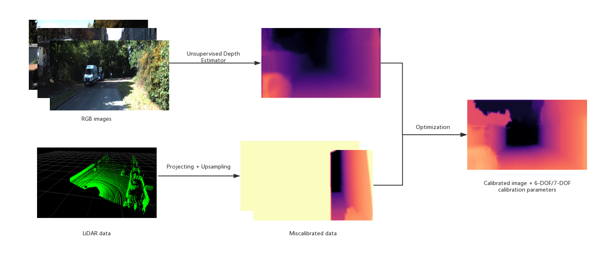

## Overview
In this work, we use unsupervised depth estimators to predict depth maps and optimize the distances between predicted depth maps and miscalibrated projected depth images. 

Estimator:

- Check out this branch [Monodepth](https://github.com/KruskalLin/Autocalibration/tree/monodepth)[1]

## Upsampling Toolbox

We provide several upsampling methods implements for calibration and depth refinement after calibration. We also modified some upsampling methods for less time cost and higher accuracy.

|  **Method**   |  RGB | Linear | Nearest | KNN | Barycentric | Grid Weight |
|  ----  | ---- | ----  | ----  | ----  | ----  | ----  |
| **Result**  | 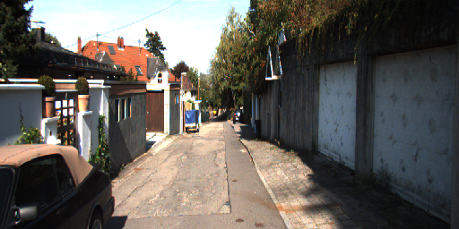  |  | 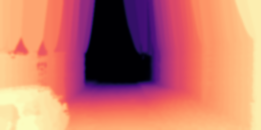 |  | 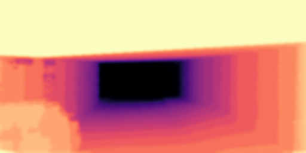 |  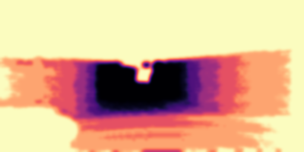 |

|  Method   | Anisotropic Diffusion[2] | SD-Filter[3]  | Geometry | Modified Spatial[4] | Total Generalized Variation[5] |  Clough Tocher |
|  ----  | ---- | ----  | ----  | ----  | ----  | ----  |
| Result  | 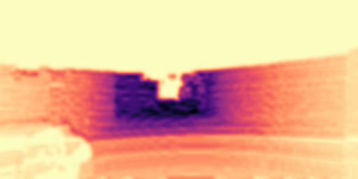 | 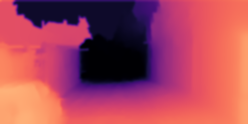 | 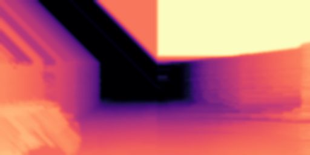 | 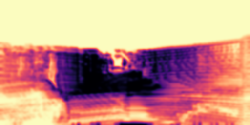 |  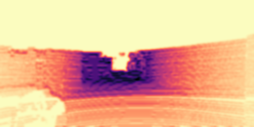 | 

## Optimization

We use [Hyperopt](https://github.com/hyperopt/hyperopt) for based optimization algorithms because the projection and cost calculation process is not explicitly convex and differentiable. An approximate training detail for three rotation parameters:

|  **Method**   |  Bayesian Optimization | Stimulated Anneal |
|  ----  | ---- | ----  |
| **Loss**  | 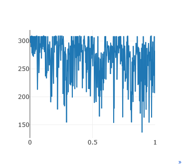  | 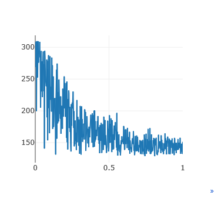 |

## Result

|  RGB   | Predicted depth map  | Calibrated depth map  |
|  ----  | ---- | ----  |
|   | 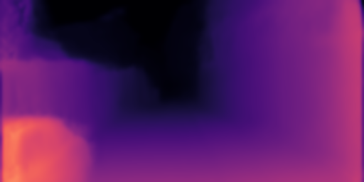 | 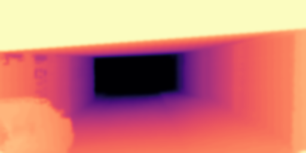 |
| 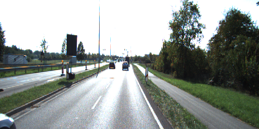  | 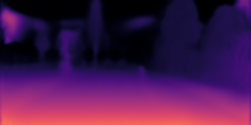 | 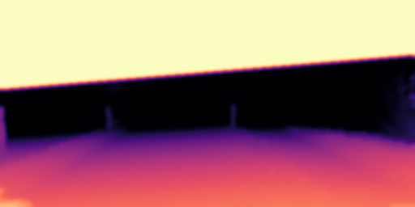 |
| 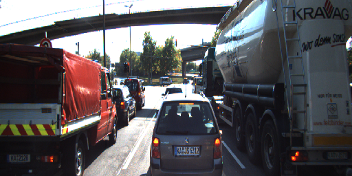  | 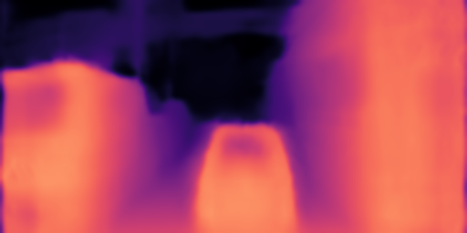 | 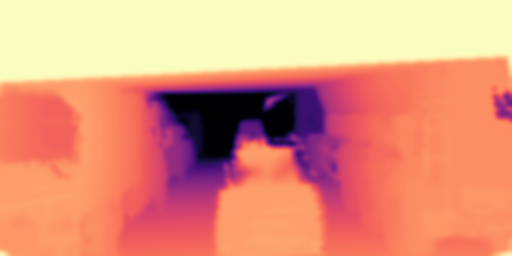 |
| 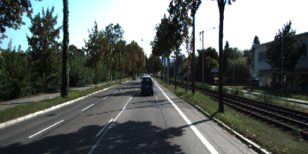  | 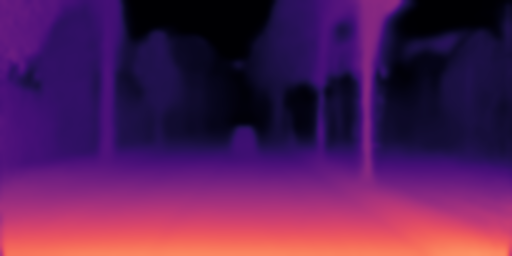 | 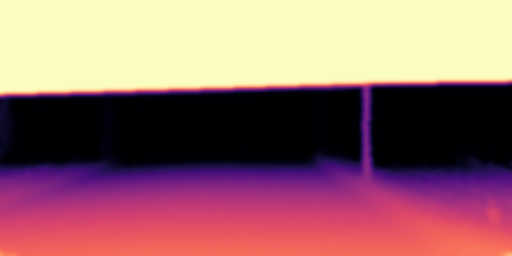 |

## Reference
[1] **Unsupervised Monocular Depth Estimation with Left-Right Consistency.** Clément Godard, Oisin Mac Aodha and Gabriel J. Brostow. In CVPR, 2017

[2] **Guided Anisotropic Diffusion and Iterative learning for Weakly Supervised Change Detection.** Rodrigo Caye Daudt, Bertrand Le Saux, Alexandre Boulch, Yann Gousseau. In CVPR, 2019

[3] **Robust Image Filtering using Joint Static and Dynamic Guidance.** Bumsub Ham and Minsu Cho and Jean Ponce. In CVPR, 2015

[4] **A Novel Way to Organize 3D LiDAR Point Cloud as 2D Depth Map Height Map and Surface Normal Map.** Yuhang He, Long Chen, Jianda Chen, Ming Li. In ROBIO, 2015

[5] **Image Guided Depth Upsampling using Anisotropic Total Generalized Variation.** David Ferstl, Christian Reinbacher, Rene Ranftl, Matthias Rüther and Horst Bischof. In ICCV, 2013

## Licence
Our work is under [Creative Commons Legal Code](https://creativecommons.org/licenses/by/3.0/legalcode).
