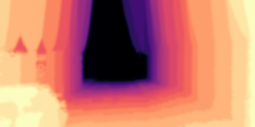

# Simple Extrinsic Autocalibration
In this work, we use unsupervised depth estimators to predict depth maps and optimize the distances between predicted depth maps and miscalibrated projected depth images. 

Estimator:

- Check out this branch Monodepth[1]

## Upsampling Toolbox

<ul> 
    <li>
        <a style="float:left; padding:4px 8px; width:160px">
           
           Linear Upsampling
        </a>
    </li> 
    <li>
        <a style="float:left; padding:4px 8px; width:160px">
           
           Nearest Upsampling
        </a>
    </li> 
    <li>
        <a style="float:left; padding:4px 8px; width:160px">
           
           KNN Upsampling
        </a>
    </li> 
    <li>
        <a style="float:left; padding:4px 8px; width:160px">
           
           Barycentric Upsampling
        </a>
    </li> 
</ul> 
